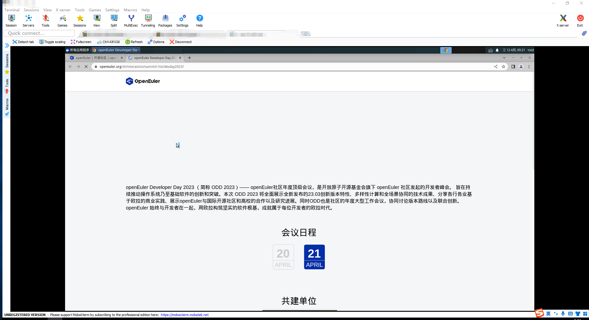

# ops-sandbox

## 一、背景

为防止有人向五大社区的邮件列表owner投毒， 或者通过飞书向openeuler.sh投毒，或者通过gmail向openeuler.io投毒，现在将阅读邮件的环境制作成沙箱：通过入口加入白名单，出口除了放行80和443端口，其余都限制掉。通过这样方式，可以有效的防止打开病毒文件造成本机相关文件出现泄密等情况。

## 二、方案设计

### 1.使用华为云提供的ECS实例

#### 1.方案详解

方案一: 调用华为云ecs接口创建资源，然后创建安全组规则进行限制

~~~bash
入口处理：
将所有的入口ip全部封，然后ip加入白名单才能访问。

出口限制：
限制出口ip, ip只能访问特定的域名，
~~~

#### 2.方案优缺点

1.优点是:可以利用华为云提供的API进行资源的创建，整个流程比较简单。

2.缺点是:ECS实例太重了，而且费用也比较贵。

### 2.使用容器的方式

#### 1.方案详解

方案一:  容器中跑浏览器进程，但是无法查看下载文件。不满足条件
			   详细参考：https://juejin.cn/post/7076824881546919950

**方案二**： 以ubuntu 22.04为基础镜像，安装TigerVNC Server服务 + xfce4 + 浏览器
				详细参考：https://blog.csdn.net/lxyoucan/article/details/121679346
				详细参考：http://qclog.cn/1335

#### 2.方案优缺点

1.优点是：docker容器轻量化，成本低，随时拿来可用

2.缺点是：没有缺点，完美的方案。

### 3.方案的落地

以使用容器的方案二进行落地：安装TigerVNC Server服务 + xfce4 + 浏览器

## 三、基础镜像制作

1.创建一个CONTAINER

~~~bash
docker run -dit --name ubuntu-sandbox -p 5901:5901 ubuntu /bin/bash

修改ubuntu的源为国内源，请参考：
https://blog.csdn.net/lxyoucan/article/details/121691910
~~~

2.docker镜像unminimize,非docker可忽略！！！

~~~bash
如果你在docker中ubuntu中配置vnc。配置完成以后，发现一个奇怪的问题。发现图形界面中，中文不全面 。有一些地方依然显示的英文的。虽然不影响，但是强迫证受不了。经过我各种研究和尝试，终于找到了原因。因为docker中的ubuntu是精简版本的，有一些软件包被精简了导致。解决办法，就是恢复正常模式。
执行以下命令：
	unminimize
~~~

3.中文环境配置

~~~bash
echo $LANG

locale -a

apt install language-pack-zh-hans

vim /etc/environment 在文件尾部追加
LANG="zh_CN.UTF-8"
LANGUAGE="zh_CN:zh:en_US:en"

vim /etc/profile
LANG="zh_CN.UTF-8"
LANGUAGE="zh_CN:zh:en_US:en"

vim ~/.bashrc
LANG="zh_CN.UTF-8"
LANGUAGE="zh_CN:zh:en_US:en"

sudo locale-gen
source ~/.bashrc
~~~

4.安装TigerVNC Server

~~~bash
apt install tigervnc-standalone-server -y
~~~

5.安装xfce4精简版本

~~~bash
#精简安装
sudo apt-get install -y --no-install-recommends xubuntu-desktop 
#不安装这个会报错Failed to execute child process “dbus-lauch”(xxxxx)
apt install dbus-x11 -y
#安装中文字体 ,否则会出现乱码
apt install fonts-wqy-microhei -y
#安装中文语言名和fcitx中文输入法
apt install -y \
gnome-user-docs-zh-hans \
language-pack-gnome-zh-hans \
fcitx \
fcitx-pinyin \
fcitx-table-wubi
~~~

6.配置

+ 新建用户

  ~~~bash
  #新建用户
  adduser admin
  #切换到用于vnc的用户
  su admin
  #设置vnc连接密码
  vncpasswd
  ~~~

+ 修改xstartup配置

  ~~~bash
  su admin
  
  vim ~/.vnc/xstartup
  #!/bin/sh
  unset SESSION_MANAGER
  unset DBUS_SESSION_BUS_ADDRESS
  export GTK_IM_MODULE=fcitx
  export QT_IM_MODULE=fcitx
  export XMODIFIERS=@im=fcitx
  export LANG=zh_CN.UTF-8
  fcitx -r
  startxfce4
  ~~~

  等待执行完成了，重启vnc服务，这时发现，部分汉化不完全的问题已经成功解决了。这样做的缺点也很明显，使整个镜像的体积增大了。这就看你的取舍了。建议在配置vnc前执行unminimize，这样会更快一些。配置完vnc在执行也是可以，就是要等久一些。

7.启动vnc服务

~~~bash
vncserver :1 -localhost no -geometry=1920x1080

:1是端口，最终tcp端口是此数字+5900 ，也就是1+5900=5901
-localhost no 默认为yes，设置成no则可以非localhost也可以连接vnc
-geometry 设置分辨率
~~~

8.FAQ

~~~BASH
1.报错Failed to connect to socket /var/run/dbus/system_bus_socket: No such file or directory

sudo /etc/init.d/dbus start

2.为什么不以openEuler为基础镜像来制作？
openEuler缺包，包括：dbus-x11,tigervnc-standalone-server
~~~

## 四、启动基础镜像

1.将基础镜像推送到swr作为基础镜像

~~~bash
swr镜像名称:  swr.cn-north-4.myhuaweicloud.com/openeuler/ops-sandbox:v1.0
~~~

2.制作镜像和启动镜像

~~~bash
docker build -t sandbox-new .
docker run -dit --name ops-sandbox-new-test-test -p 5903:5903 sandbox-new:latest
~~~

3.以vnc客户端登录，比如说MobaXterm

## 五、配置安全组规则

~~~bash
入口处理：
将所有的入口ip全部封，然后ip加入白名单才能访问。

出口限制：
限制出口ip, ip只能访问特定的域名,比如说gmail邮箱，飞书邮箱，五大社区的邮件列表的服务站点，其余都需要封掉。
~~~

